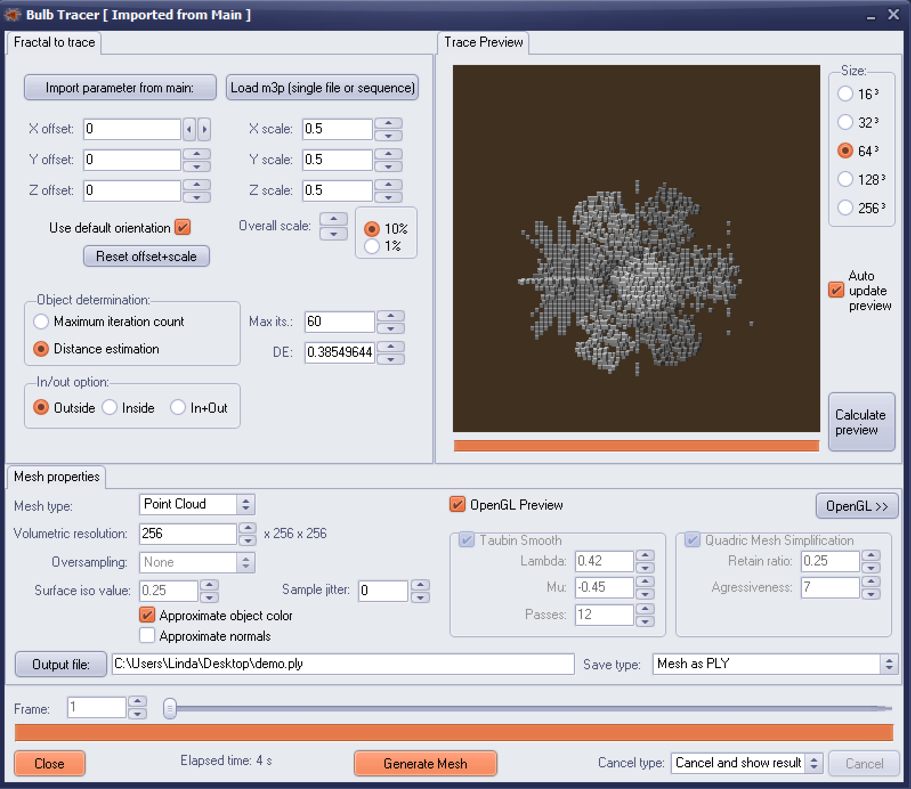

# Openvdbfractals

This simple command line tool can convert point clouds to OpenVDB format (using DreamWorks' OpenVDB library, see https://www.openvdb.org/). I use it for converting fractals made in Mandelbulb3D to Cinema4D and render the fractals using Octane. I think there's also some work done on OpenVDB support in Blender (Google Summer of Code 2018), but I don't think it's included yet in version 2.8 (please correct me if I'm wrong!).

# Install on Windows

A precompiled version for Windows is included in the directory windowsx64. I used vcpkg to install the dependencies. My vcpkg configuration is listed in vcpkglist.txt (contains more packages than you'll need). I didn't use CMake for building on Windows, but created a Visual Studio project myself.

# Install on Linux

Just build the included Dockerfile. To do this, first go to the directory of the Dockerfile. Then run the following commands: 
1) docker build . -t openvdbfractals
2) docker run --rm -ti -v /home/linda:/home/linda openvdbfractals bash

# Use the tool

Requirements:
- Mandelbulb3D v1.9.9
- Cinema 4D 
- Octane (or another render engine that supports OpenVDB)

We’ll start by making a fractal in Mandelbulb3D. 

I assumed you are familiar with Mandelbulb3D and are able to create your own fractal. If you’re not, you can import these parameters by using the button ‘From clipboard’.

Mandelbulb3Dv18{
g…..S….O/…w….2……………1…….s1E…………………………..
………………………………….kz1……..A./………………y.2…wD
…Uz6….k/…./M.0/……l….9/….E3…..omEQgisq6rD/……….m/dkpXm1….U
z…..kD12../2k/..u/.sDpz8..UW3Xi7yj2..kcNYgbzf/..s1Z0knz.U0…..y1…sD…../..
.z1…sDYsAIxzzzjz1……….WAbUdisqcljRRxgCKosEwnYRydIKa5uzwPN9SaPRGyDFHQlSHA1
Iw1iNMIOip7tzqF/G0ZZtVyDU…..21…………..sD.6….sD..G…………………
………….oAnAt1…sD….zw1…………………………………..R….k1.
…..83iyz1…….kz.wzzz1.U..6.P….U5…EB….m….c3….F….6/…I1…..SF52
…U.qFG9yzb2zzzRYoWzz7lz16.pc..zXCc..kvrEtMc7xD6ocyFE0ujz1……….2.28.kFrA0.
.Ub96aAIVz9.1se7Umvxz0………./EU0.wzzz1………..s/……………….E.2c..
zzzz………….0……………….2./8.kzzzD…………8………………..
/EU0.wzzz1……………………………..MpQT0UvNPcvee0RUx3.yRiibHJJnRIV..XR
SvBmx3dLA0UvNPcvQsLIHm5.ibhVi1bTIZ4K.sSq4uClyp5W8/UvNPcvMwbjZl3.ibhVinqTg7fJ.sSq
4uCkzxYf60UvNPcv..EsUa3feeWCNqGQIJ36wk8EwyLsUa3f…………………………..
E….Ek.l2E…..I….k….UEI31IdtKNbxaP…IjR5…………………………6U.
06U………………/………EvQc7EdgRgznKL3TraOtUz………………………
..kH.d82975vJSxD……..kz1……….F6hMjeapx2EbdZ3DQU5A.2…………………
…………………2…..3….5….EZQdNqPsBoPh/5PZVLEiR4PZB5……………..
0IV.06E./………………….E……..cz1….wxcMUzUV8b8CMyA.E……….UaNaNa
NaNizcPixrPlC6zD……………………………………………………….
……………………………….wzzzzD……IaPZBLOm.pPrN1……………..
………………………………….U.2……………………………….
……………………………………………………………………..
……………………………………k…..I….2….EHnl4RjJqItpaA……..
……………………………………Uu6wi9yEVxz………………………
……………………………………………………………………..
………………………………………………..}
{Titel: m164}

We can export the Mandelbulb3D model to a point cloud. Make sure you have version 1.9.9. Open the BTracer (Bulb tracer) and import the parameters from main. You probably will need to scale the object (I scaled to 0.5). After it fits in the preview window, you can write it to a ply file. 

The tool uses the following parameters: 
- filename: locations of the ply file
- skip: the number of lines to skip (default 11) when the ply files contains metadata/comments
- rgb (default true): use rgb channels
- magnification (default 10000): the factor for magnification

Windows: If we now run PlyToOpenVDBConverter.exe -filename <filename.ply> we get a vdb file as result.
Linux: If we now run ./openvdbfractals -filename <filename.ply> we get a vdb file as result.

Now it’s time to start Cinema 4D, enable Octane and add a Octane VDB volume. Specify the file we just created as input.

Make the volume step length lower and the fractal cloud appears (you can also make the density higher). You can change the appearance of the fractal by changing the absorption, scattering, and emission values.

Here are some examples created using this technique.

If you run into problems, just send me a message! 

